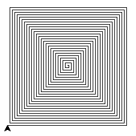

# 作业2
要求: 
    1. 尽量自己独立完成，如不懂可以问同学和老师，但是所有的代码都要自己输入，看懂，亲自运行
    2. 注意作业的截止时间，要在截止时间前提交
    3. 作业提交只需提交对应的ipynb后缀的文件
题目：


```python
import math
```

#### 查看IsPrime函数的定义，测试IsPrime函数，并说明IsPrime函数的功能。


```python
def IsPrime(x):
    for i in range(2, int(math.sqrt(x) + 1)):
        if (x % i) == 0:
            return False
    return True
```


```python
IsPrime(1)
```

IsPrime函数的功能是：

#### 编写程序，测试1~100的所有整数，根据IsPrime函数的返回结果，将返回True的添加入列表变量listPrimeA


```python

```

#### 编写程序:
1. 将1~100的所有整数添加如列表变量listPrimeB
1. 对listPrimeB中的元素进行IsPrime函数测试，删除返回False的元素


```python

```

#### 编写程序，显示ASCII在32~126之间的字符和其对应ASCII，显示结果如下:
>32   
>33      !  
>34      "  
>.........  

#### 编写程序,统计下面这句话The Zen of Python中，单词'is'出现的次数
提示，help(str.split)


```python
zen = """The Zen of Python, by Tim Peters

Beautiful is better than ugly.
Explicit is better than implicit.
Simple is better than complex.
Complex is better than complicated.
Flat is better than nested.
Sparse is better than dense.
Readability counts.
Special cases aren't special enough to break the rules.
Although practicality beats purity.
Errors should never pass silently.
Unless explicitly silenced.
In the face of ambiguity, refuse the temptation to guess.
There should be one-- and preferably only one --obvious way to do it.
Although that way may not be obvious at first unless you're Dutch.
Now is better than never.
Although never is often better than *right* now.
If the implementation is hard to explain, it's a bad idea.
If the implementation is easy to explain, it may be a good idea.
Namespaces are one honking great idea -- let's do more of those!"""
```


```python

```

#### 看懂如下Turtle绘图代码，可以查看参考资料
* [python 海龟绘图](http://blog.sina.com.cn/s/blog_b5fe6b270101hx7q.html)
* [python turtle doc](https://docs.python.org/3/library/turtle.html)


```python
from turtle import *
```


```python
for i in range(5):
    forward(200)
    right(144)
```

####  参考上面的代码，编写程序绘制如下图形



```python

```
